# Rebase Checker
Pull Request Rebase Checker Policy Service for Azure Devops on Azure Function

We created Rebase Checker to validate the state of the source branch versus the target branch in a Pull Request on Azure Devops.

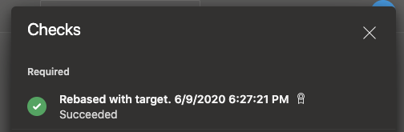

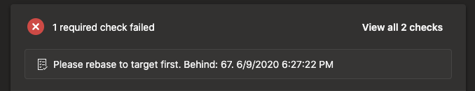

## Setup

1. Deploy your Rebase Checker to Azure Functions

2. On a Azure Devops project, select **Project settings**:  
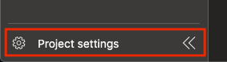

3. Select **Service hooks**:  
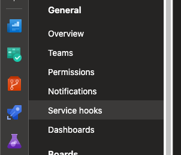

4. Add a new service hook subscription: **Web Hooks**:  
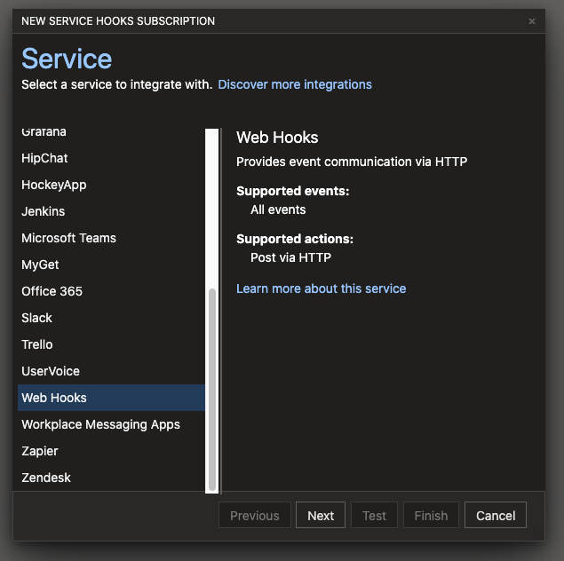

5. Select trigger **Pull request created**:  
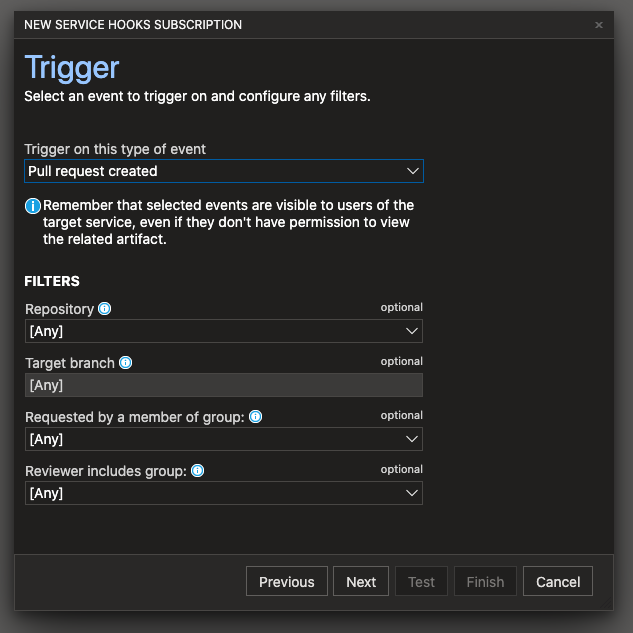

6. Add your **Rebase Checker Azure Function URL**:  
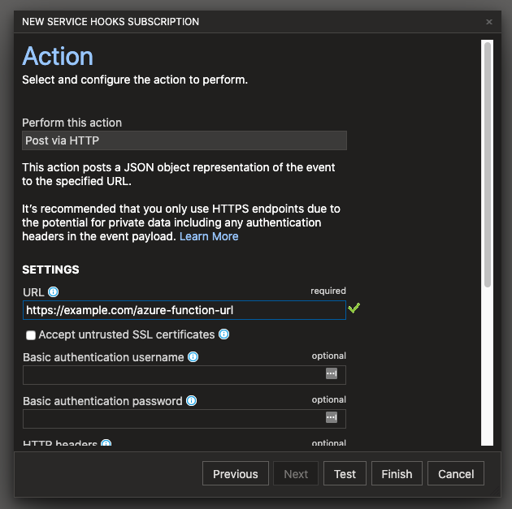

7. Now add another trigger **Pull request updated**:  
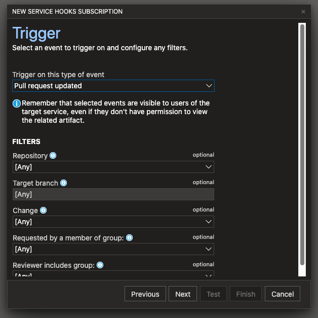

8. Add your **Rebase Checker Azure Function URL**:  

9. On project settings. select **Repositories**:  
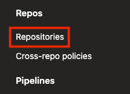

9. Select the **repository**:  
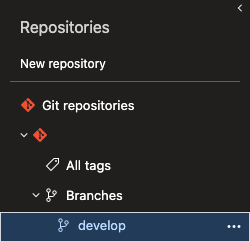

10. Select **Policies**:  
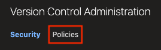

11. Select **Add status policy**:  
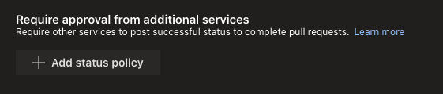

12. In **Status to check** add **checker/rebasechecker**:  
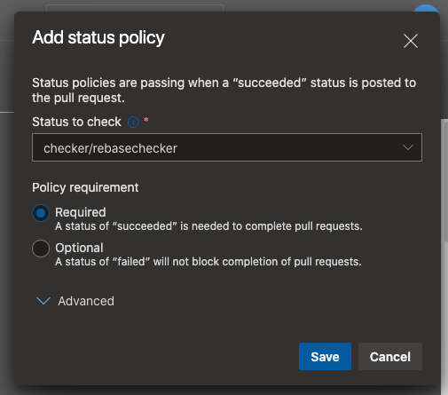